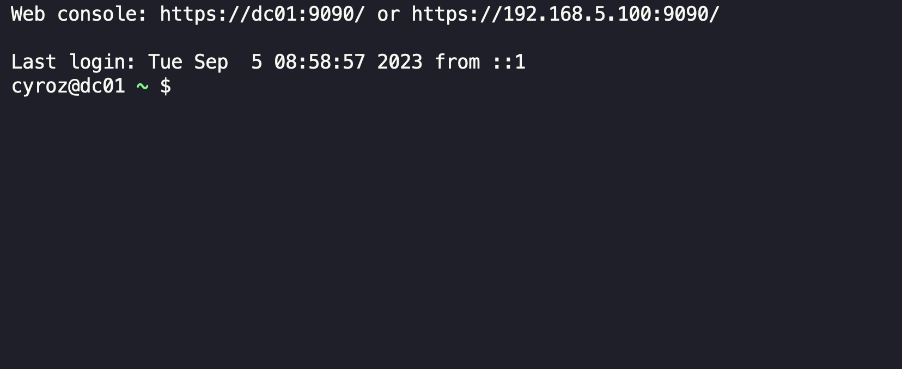
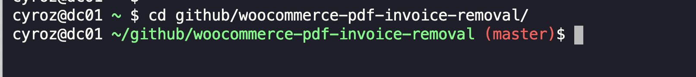
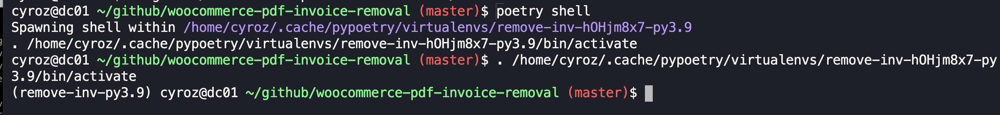
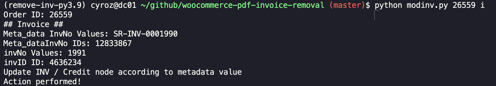
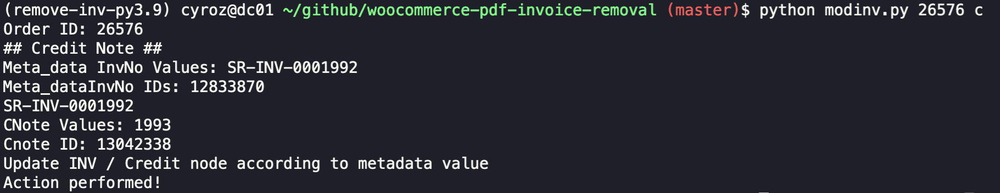

# woocommerce-pdf-invoice-removal
Automation using selenium to remove PDF invoice and credit note 


## How to update INV and Credit Note Manually

### Step by step - Login :

1. Login to [Terminal](https://terminal.shahmimajid.com/)

2. Input designated email : `admin@example.com` and proceed with **Send me a code**

3. Check your email for Cloudflare code, fill up accordingly then proceed with **Sign in**

4. Fill up `User` value and proceed with **Submit** 

5. Choose `Password` tab, fill up the password and proceed with **Submit**

6. You will be redirect to `terminal` . Screenshot as below :

    


### Step by step - Update Invoice / Credit Note :

1. From `terminal` , go to folder `github/woocommerce-pdf-invoice-removal` by running code below :

    ```$ cd github/woocommerce-pdf-invoice-removal/```

    

2. Run command below and you should be able to see virtualenv activate as per screenshot below :

    ```$ poetry shell```
    
    

3. Then, you can start to update Invoice or Credit note using command. Refer syntax below :

    Generic syntax

    ```$ python modinv.py <OrderID> <Order Type>```

4. To update Invoice, command as below. You need to indicate `i` or `inv` at the end of order .

    ```$ python modinv.py <OrderID> i```

    Example

    ```$ python modinv.py 26559 i```

    Output will be as below :

    ```(remove-inv-py3.9) cyroz@dc01 ~/github/woocommerce-pdf-invoice-removal (master)$ python modinv.py 26559 i
        Order ID: 26559
        ## Invoice ##
        Meta_data InvNo Values: SR-INV-0001990
        Meta_dataInvNo IDs: 12833867
        invNo Values: 1991
        invID ID: 4636234
        Update INV / Credit node according to metadata value
        Action performed!
    ```

    

    You can see from Output that `Meta_data InvNo Values: SR-INV-0001990` and `invNo Values: 1991` is not the same. By right, invNo Values should be ***1990*** same like `SR-INV-0001990` in `Meta_data InvNo Values`. Therefore, this script will automatically update to the correct metadata.

    If the metadata and invNo Values is exactly the same, whenever you run, it will ***DO NOTHING*** in the output.

5. To update Credit Note, command as below. You need to indicate `c` or `cn` at the end of order .

    ```$ python modinv.py <OrderID> c```

    Example

    ```$ python modinv.py 26576 c```

    Output will be as below :

    ```(remove-inv-py3.9) cyroz@dc01 ~/github/woocommerce-pdf-invoice-removal (master)$ python modinv.py 26576 c
       Order ID: 26576
       ## Credit Note ##
       Meta_data InvNo Values: SR-INV-0001992
       Meta_dataInvNo IDs: 12833870
       SR-INV-0001992
       CNote Values: 1993
       Cnote ID: 13042338
       Update INV / Credit node according to metadata value
       Action performed!
    ```

    

    You can see from Output that `Meta_data InvNo Values: SR-INV-0001992` and `invNo Values: 1993` is not the same. By right, CNote Values Values should be ***1992*** same like `SR-INV-0001992` in `Meta_data InvNo Values`. Therefore, this script will automatically update to the correct metadata.

    If the metadata and invNo Values is exactly the same, whenever you run, it will ***DO NOTHING*** in the output.

    > If an Order is not yet generated invoice and /or credit note, you will need to generate it first then run the script to update accordingly

    > Somehow when we update the order, then we rerun again the same command, it will still showing output as *** Action performed!*** eventhough we already did. I'm not so sure what is happening due to caching issue or what, but you can proceed with next order as it already update. If you check in Order detail from UI, the update already reflected.